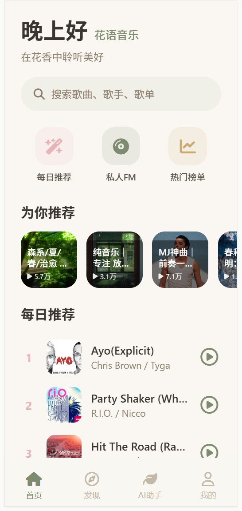
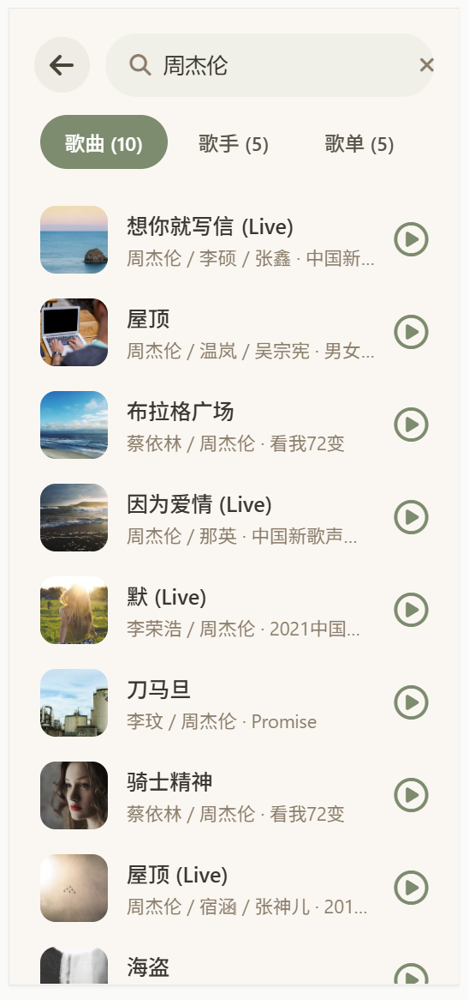
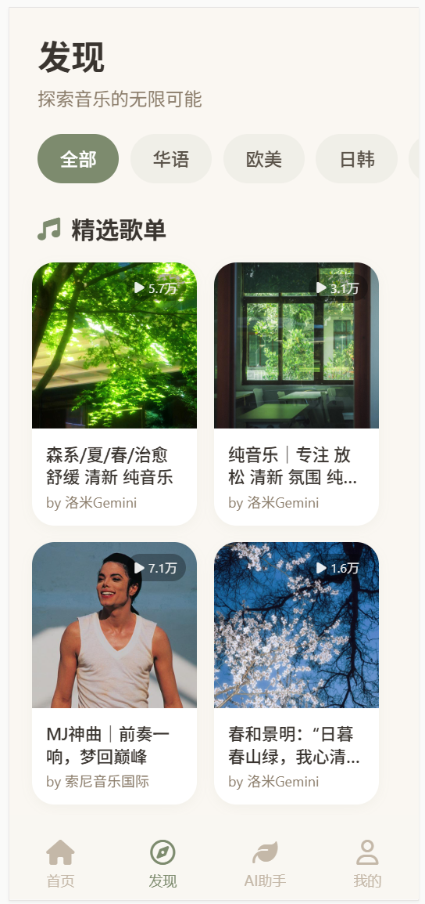
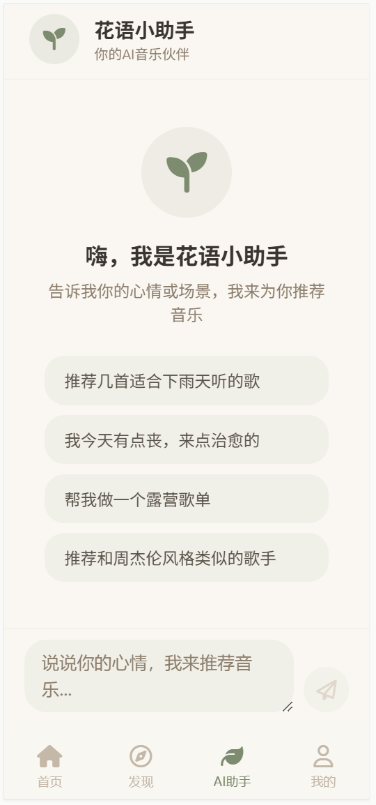
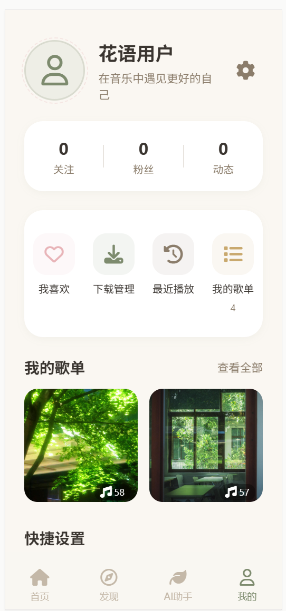

# 🌸 花语音乐 (Huayu Music)

> 森系浪漫风格的音乐播放器 App — 让每一首歌都像在花园里流淌

## 📱 界面预览

<p align="center">
  
  
  
  
  
</p>

<p align="center">
  <sub>首页 &nbsp;&nbsp;&nbsp;&nbsp;&nbsp;&nbsp;&nbsp;&nbsp; 
    &nbsp;&nbsp;&nbsp;&nbsp;&nbsp;&nbsp;&nbsp;&nbsp; 搜索 
    &nbsp;&nbsp;&nbsp;&nbsp;&nbsp;&nbsp;&nbsp;&nbsp; &nbsp;&nbsp;&nbsp;&nbsp;&nbsp;&nbsp;&nbsp;&nbsp;&nbsp;
    &nbsp;&nbsp;&nbsp;&nbsp;&nbsp;&nbsp;&nbsp;&nbsp; 发现 &nbsp;&nbsp;&nbsp;&nbsp;&nbsp;&nbsp;&nbsp;&nbsp; 
    &nbsp;&nbsp;&nbsp;&nbsp;&nbsp;&nbsp;&nbsp;&nbsp; AI助手 &nbsp;&nbsp;&nbsp;&nbsp;&nbsp;&nbsp;&nbsp;&nbsp; 
    &nbsp;&nbsp;&nbsp;&nbsp;&nbsp;&nbsp;&nbsp;&nbsp; 我的</sub>
</p>

---

## ✨ 特色功能

### 🎵 多音源搜索播放
- 支持网易云音乐、咪咕音乐、B站音频等多个音乐源
- 智能自动切换，一个源播不了自动试下一个
- 搜索歌曲、歌手、歌单，一点即播

### 🤖 AI 音乐助手
- 自然语言生成专属歌单："给我推荐适合下雨天写代码的歌"
- 心情推荐、场景歌单、歌词解读、音乐百科
- 对话式交互，像跟一个懂音乐的朋友聊天

### 🎼 精致播放体验
- 花瓣形黑胶唱片旋转动画
- 实时滚动歌词，当前行高亮
- 唱片模式 / 歌词模式 自由切换

### 📚 丰富的发现页
- 每日推荐、热门榜单、新碟上架
- 为你精准推荐，发现更多好音乐
- 我的歌单、最近播放、我喜欢的音乐

### 🌿 森系浪漫设计
- 米白 + 鼠尾草绿 + 玫瑰粉 配色
- 水彩叶片纹理、金色星光粒子、藤蔓花朵装饰
- 每一个界面都是治愈系的视觉享受

---

## 📱 详细功能介绍

### 🏠 首页 — 每日推荐 & 个性化发现
森系浪漫风首页，每日推荐歌单、私人FM、热门榜单一目了然。花瓣形歌单卡片 + 藤蔓装饰元素，打开就被治愈。

- 🌟 每日推荐：根据你的口味每天更新30首
- 🎧 私人FM：随机播放惊喜好歌
- 🔥 热门榜单：飙升榜、新歌榜、热歌榜实时更新
- 💡 为你推荐：多分类选项卡，华语/欧美/日韩/民谣全覆盖

---

### 🔍 搜索页 — 多音源秒搜你想听的
搜索框输入歌名、歌手或歌词，多平台同时搜索，结果合并展示。支持歌曲 / 歌手 / 歌单 / 专辑 分类筛选。

- 🎵 多音源并行搜索：网易云 + 咪咕 + B站
- 🎤 歌手分类：直接查看歌手全部热门歌曲
- 📋 歌单分类：找到心仪歌单一键收藏
- ⚡ 秒级响应，边打字边出结果

---

### 🔥 发现页 — 发现更多好音乐
精选歌单、热门榜单、新碟上架，每天都有新发现。精美歌单封面，点进去就是惊喜。

- 📚 官方精选歌单：晨起森语 / 午后花园 / 夜听花语
- 🏆 各大榜单：云音乐热歌榜、新歌榜、原创榜
- 💿 新碟上架：最新专辑第一时间推荐
- 🎭 情绪歌单：开心 / 治愈 / 专注 / 浪漫 / 失眠

---

### 🤖 AI 助手页 — 懂你的音乐搭子
像跟朋友聊天一样说需求，AI帮你生成专属歌单。心情好、心情差、学习、运动… 任何场景都能推荐。

- 💬 自然语言生成歌单："给我做一个适合下雨天写代码的歌单"
- 🎭 心情推荐："我今天有点丧，来点治愈的"
- 🏕️ 场景歌单："明天露营，帮我做个露营歌单"
- 📖 歌词解读："这首歌讲的是什么故事？"
- 🎤 歌手探索："推荐和陈绮贞风格类似的歌手"
- ✨ 回复中的歌曲点击即播，歌单一键收藏

---

### 💿 播放页 — 花瓣黑胶沉浸式体验
花瓣形状黑胶唱片缓缓旋转，周围星光粒子流动。滚动歌词实时跟随，享受纯粹的音乐时光。

- 🌸 花瓣形黑胶唱片，旋转动画优雅流畅
- ✨ 金色星光粒子效果，梦幻氛围感
- 📝 滚动歌词，当前行高亮，字里行间都是故事
- 🔄 唱片模式 / 歌词模式 左右滑动切换
- ⏮️ ⏯️ ⏭️ 完整播放控制，进度条随心拖动
- ❤️ 喜欢 / 收藏 / 分享 / 评论 一应俱全

---

### 📚 我的 — 你的音乐花园
所有收藏的歌单、喜欢的音乐、最近播放，都在你的专属音乐花园里。

- ❤️ 我喜欢的音乐：每一颗心都是你的偏爱
- 🕐 最近播放：找回刚才那首心动的歌
- 📂 本地下载：离线也能听
- 🎵 我的歌单：自建歌单，自定义封面和名字
- 📥 收藏的歌单：收藏的宝藏都在这里

---

## 🚀 快速开始

### 在线预览

👉 [点击体验花语音乐](https://www.coze.cn/p/7656009939789316146)

### 本地运行

```bash
# 克隆项目
git clone https://github.com/你的用户名/huayu-music.git
cd huayu-music

# 安装依赖
npm install

# 启动开发服务器
npm run dev

# 打包构建
npm run build
```

### 环境变量配置

复制 `.env.example` 为 `.env`，填写你的配置：

```env
# 网易云音乐 API 地址（可选，不填使用内置公共源）
VITE_NETEASE_API_BASE=https://your-netease-api.example.com

# 咪咕音乐 API 地址（可选）
VITE_MIGU_API_BASE=https://your-migu-api.example.com

# AI 大模型配置
VITE_LLM_API_KEY=your-api-key
VITE_LLM_BASE_URL=https://open.bigmodel.cn/api/paas/v4
VITE_LLM_MODEL=glm-4
```

---

## 🏗️ 技术栈

| 层级 | 技术 |
|------|------|
| 前端框架 | React + TypeScript + Vite |
| 样式方案 | Tailwind CSS |
| 状态管理 | Zustand |
| 音频播放 | HTML5 Audio API |
| 音乐源 | 网易云 / 咪咕 / B站（可扩展） |
| AI 能力 | 智谱 AI / OpenAI 兼容接口 |
| 项目类型 | 移动端 Web App / H5 |

---

## 📁 项目结构

```
huayu-music/
├── src/
│   ├── components/        # 通用组件
│   │   ├── Player/        # 播放器组件
│   │   ├── SongList/      # 歌曲列表组件
│   │   └── TabBar/        # 底部导航
│   ├── pages/             # 页面
│   │   ├── Home/          # 首页
│   │   ├── Discover/      # 发现页
│   │   ├── Assistant/     # AI助手页
│   │   ├── Library/       # 资料库
│   │   └── Search/        # 搜索页
│   ├── hooks/             # 自定义 hooks
│   ├── utils/             # 工具函数
│   ├── api/               # API 请求
│   │   ├── netease/       # 网易云音乐 API
│   │   ├── migu/          # 咪咕音乐 API
│   │   └── llm/           # AI 大模型 API
│   ├── store/             # 状态管理
│   ├── styles/            # 全局样式
│   └── App.tsx            # 应用入口
├── public/                # 静态资源
├── .env.example           # 环境变量示例
├── package.json
├── vite.config.ts
├── tsconfig.json
├── tailwind.config.js
└── README.md
```

---

## 🎨 设计规范

### 配色方案

| 颜色 | 色值 | 用途 |
|------|------|------|
| 米白 | `#FAF7F2` | 背景色 |
| 鼠尾草绿 | `#7D8B6E` | 主色调 |
| 玫瑰粉 | `#E8B4B8` | 点缀色 |
| 暖棕 | `#8B7355` | 文字色 |
| 浅粉 | `#F5E6E8` | 浅背景 |
| 浅绿 | `#E8EDE3` | 浅背景 |

### 设计理念
- 🌿 自然治愈：像漫步在花园里的听歌体验
- 🌸 浪漫精致：每一个细节都充满仪式感
- ✨ 光影流动：金色星光粒子点缀，梦幻氛围拉满

---

## 🤝 参与贡献

欢迎各种形式的贡献！

- 🐛 发现 Bug？提个 [Issue]
- 💡 有新想法？提个 [Feature Request]
- 🔧 想写代码？欢迎提 [Pull Request]

### 贡献指南

1. Fork 本仓库
2. 创建你的特性分支 (`git checkout -b feature/AmazingFeature`)
3. 提交你的改动 (`git commit -m 'Add some AmazingFeature'`)
4. 推送到分支 (`git push origin feature/AmazingFeature`)
5. 开启一个 Pull Request

---

## 📄 许可证

本项目采用 [MIT License](LICENSE) 许可证。

> ⚠️ 免责声明：本项目仅供学习交流使用，音乐版权归各平台所有。请支持正版音乐，勿用于商业用途。

---

## 🙏 致谢

- [NeteaseCloudMusicApi](https://github.com/Binaryify/NeteaseCloudMusicApi) — 网易云音乐 API
- 所有提供公共 API 服务的开发者们
- 每一位为开源音乐生态做出贡献的人

---

<p align="center">
  <sub>Made with 🌸 by 流星雨</sub>
</p>
